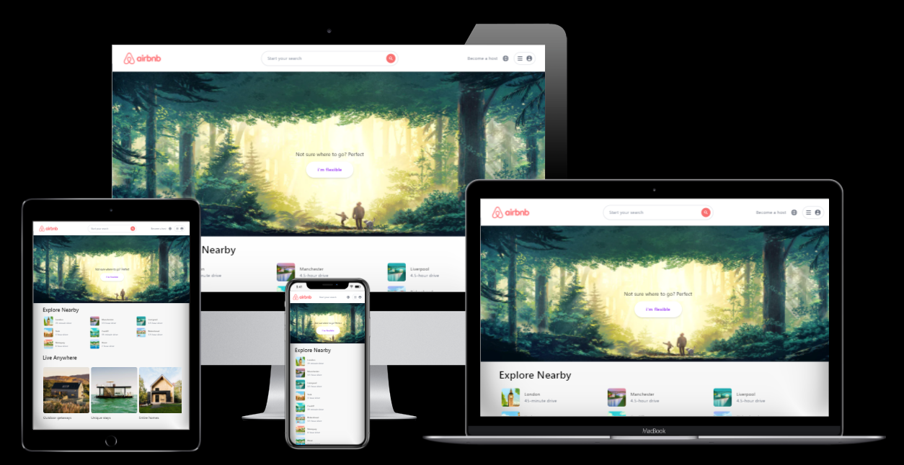

  

  <h3 align="center">Amazon Clone</h3>

  

    <a href="https://airb-n-b-clone.vercel.app">View Demo</a>
    ·
    <a href="https://github.com/UAsad99/Airbnb-Clone/issues">Report Bug</a>
    ·
    <a href="https://github.com/UAsad99/Airbnb-Clone/issues">Request Feature</a>
  

<!-- ABOUT THE PROJECT -->
## About The Project

<b>Airbnb Clone</b>. Search places that suitable for you

### Built With

* [React ( Next.js )](https://nextjs.org)
* [TailwindCss](https://tailwindcss.com)
* [Map Box](https://www.mapbox.com)

## Contact

Asad - [Telegram](https://t.me/ua_tm) - uasad99@gmail.com

Project Link: [https://github.com/UAsad99/Airbnb-Clone](https://github.com/UAsad99/Airbnb-Clone)
